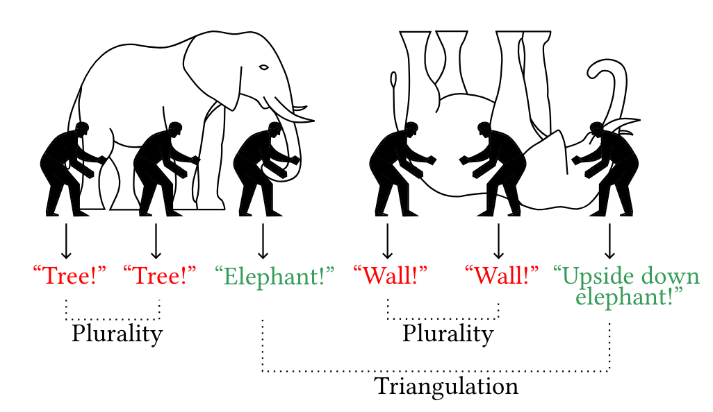

# just-tri-it

LLM-generated code often contains bugs and vulnerabilities due to hallucinations. This is hard to fix in practice because expected behavior is rarely formally specified, hindering automatic verification. To alleviate this problem, JUST-TRI-IT implements __semantic triangulation__ that verifies cross-task solution consistency. Given a programming problem, JUST-TRI-IT first nontrivially transforms it while preserving an exact, verifiable mapping between solutions before and after transformation. In particular, it applies partial inversion, answer enumeration and problem decomposition. Then, it samples solutions to the original and transformed problems; their agreement increases confidence in correctness. This is because hallucinations rarely remain consistent under semantic transformations, as illustrated using the parable of the blind men and an elephant:

In our mathematical model of LLM hallucinations, we prove that such verification increases the probability that generated programs reflect accurate generalization rather than spurious statistical correlations. Details of the approach are discussed here:

__Reducing Hallucinations in LLM-Generated Code via Semantic Triangulation__ 
Yihan Dai, Sijie Liang, Haotian Xu, Peichu Xie, Sergey Mechtaev 
https://arxiv.org/abs/2511.12288

## Preliminaries

Set your 302.ai API key using the environment variable `AI302_API_KEY`.

The project uses uv to manage dependencies.

Run linter and type checker:

    uv run ruff check .
    uvx mypy src/
    
To run tests, execute `uv run pytest`.

## Usage

just-tri-it supports multiple workflows:

### Benchmarking

The goal of the benchmarking tool is to compare various tool configurations on various code generation datasets and compute basic statistics.

To run a benchmark, execute

    uv run benchmark --dataset DATASET [ --task TASK_ID ] --selector TOOL_CONFIG --model MODEL

For example

    uv run benchmark --dataset datasets/test.json --selector Plurality --model gpt-4o
    
For LiveCodeBench v6, first decompress the dataset using

    unzip datasets/lcb_part6.json.zip
    
A specific task can be specified using `--task`:
    
    uv run benchmark --dataset datasets/lcb_part6.json --selector CodeT_IO --model gpt-4o --task atcoder_abc387_b
    
List of configurations:

- `Plurality`
- `MaxTest_Assert`
- `MaxTest_IO`
- `CodeT_Assert`
- `CodeT_IO`
- `Syntactic`
- `OffByOne`
- `Postcondition`
- `FWD_INV`
- `FWD_SINV`

### Experiments

The goal of the experimentation tool is to provide comprehensive measurements and allow for iterative improvements.

To run LiveCodeBench v6, first decompress the dataset using:
    
    unzip datasets/lcb_part6.json.zip
    
Then, to collect experimental results and save (append) into `data_dir`, execute

    uv run experiment  --dataset datasets/lcb_part6.json --model gpt-4o --data data_dir

You can specify a specific task to run via the option `--only atcoder_abc387_b`.

Then, to compute measures and generate plots, execute

    uv run analyze --data data_dir --report report_dir
    
## Extra options

To execute generated progarms in isolated subprocesses, please create an environment for testing generated programs:

    uv venv --no-project --seed --python 3.13 test_venv
    source test_venv/bin/activate
    pip install -r test_requirements.txt
    deactivate
    
Adding the options `--test-venv test_venv/` to the above commands will run generated programs inside this environment.

## Reproducibility

just-tri-it provides the following options to manage LLM cache:

- `--cache-root DIR` to set LLM cache (default: `~/.just_tri_it_cache/`)
- `--export-cache DIR` to explore all cached samples used during the run to a different directory
- `--no-cache` to disable cache
- `--replicate` to use only cache; fail in case of cache misses

Any experiment should be reproducible if the following pieces of information are provided:

- A commit hash of this repository
- A bash command to be executed from the root of this repository

Additionally, to replicate the experiment, it is sufficient to provide:

- The commit hash of your LLM cache

Cache can be downloaded from

    https://github.com/msv-lab/just-tri-it-cache-USER/archive/COMMIT.zip

where `USER` can be `yihan`, `haotian`, `sijie`, `sergey`.

## Experimental data

Everything that is not trivially derivable from LLM cache, should be stored in https://github.com/msv-lab/just-tri-it-data
