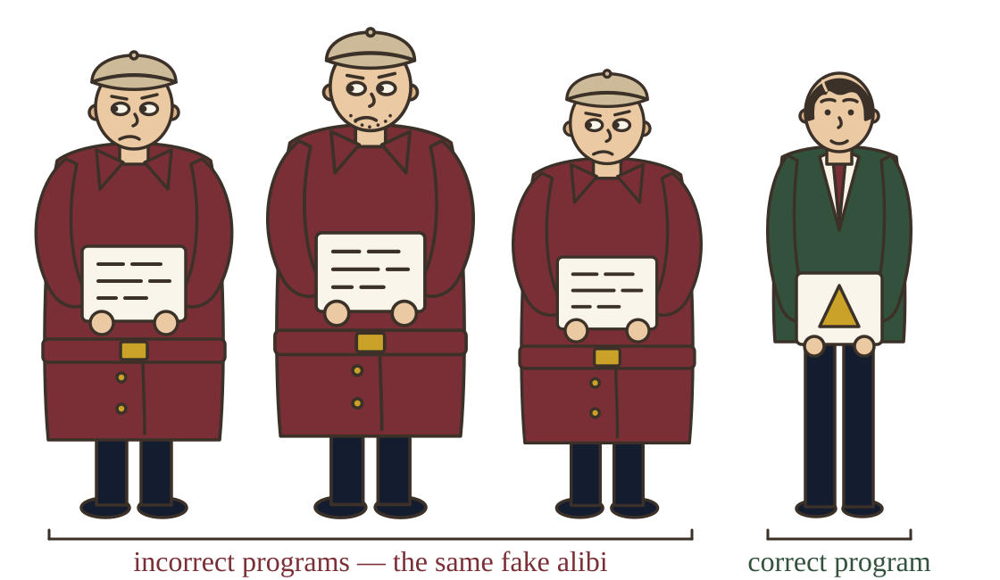
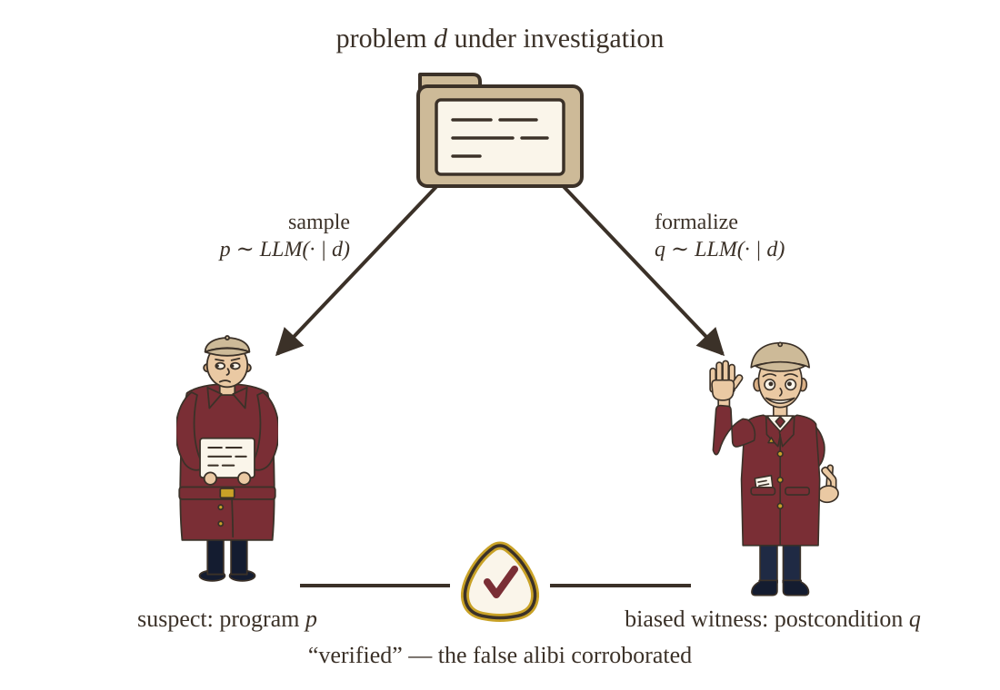
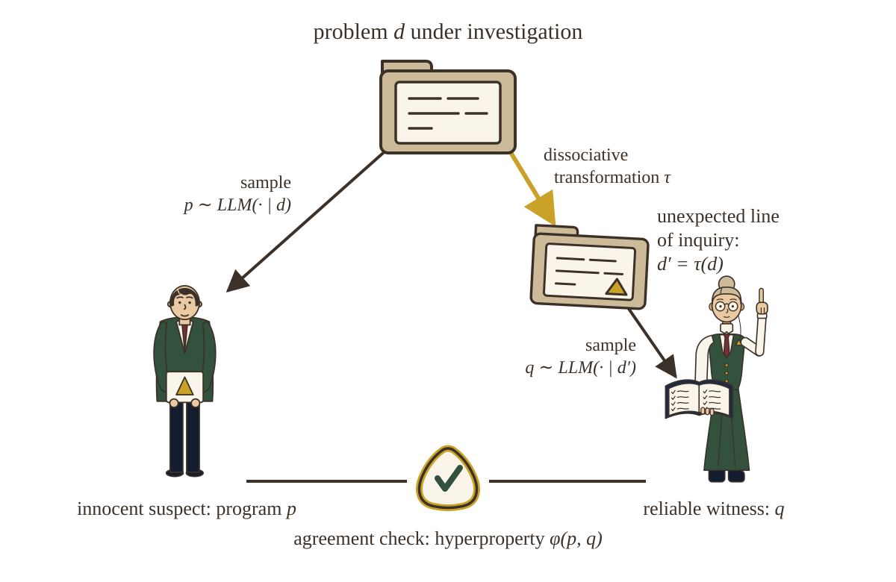

<h3 align="center">Reducing Hallucinations in LLM-Generated Code via Semantic Triangulation</h3>

Yihan Dai, Sijie Liang, Haotian Xu, Peichu Xie, Sergey Mechtaev 
<a href="https://arxiv.org/abs/2511.12288">arXiv:2511.12288</a>

LLM-generated code often contains hallucinated bugs, and since expected behavior is rarely formally specified, they are hard to detect automatically. Identifying which, if any, of the sampled programs are correct is akin to a police detective questioning suspects. Because LLMs make *correlated errors*, most suspects have colluded on the same fake alibi — so plurality (majority) voting does not identify the truth; it merely amplifies their shared deception.

Previous methods bring in extra witnesses: LLM-generated tests, or specifications auto-formalized from the problem description (e.g., Hoare-style postconditions). But these witnesses are produced by the same LLM and share the suspects' flawed logic — a *biased witness* who swears an oath with crossed fingers and corroborates the false alibi:

just-tri-it plays the inspector, exposing lies by questioning the problem from an unexpected angle to obtain a *reliable witness*. This is called __semantic triangulation__:

> A __semantic triangulation__ (τ, φ) consists of a *dissociative* problem transformation τ and a relation over pairs of programs (a hyperproperty) φ that induces a bijection between semantic equivalence classes of programs, mapping correct solutions of a problem *d* to correct solutions of the transformed problem τ(*d*).

Given the problem *d* under investigation, the inspector opens an unexpected line of inquiry *d′* = τ(*d*), samples solutions to both problems independently, and cross-examines them with φ:

Each requirement plays its own role in the interrogation:

- __Dissociative__: solving τ(*d*) requires a fundamentally different algorithm, so the question comes from an angle wholly unrelated to the suspects' rehearsed alibi — unlike mere paraphrasing, which they withstand. Implemented transformations include partial inversion (swap input and output), answer enumeration (output *all* valid answers), and problem decomposition.
- __Bijection-inducing__: distinct errors in solutions to *d* map to distinct errors in solutions to *d′*, so even subtle inconsistencies between fabricated stories are detected, and two independent lies rarely match by coincidence.
- __Correctness-coupling__: the bijection maps correct solutions to correct solutions, so a truthful account is always corroborated by a truthful witness.

A correct program's story holds up under any line of questioning; hallucinated programs, like liars caught off guard, betray themselves through contradiction. Under our mathematical model of LLM hallucinations, we prove that agreement with such a triangulated witness yields strictly higher confidence of correctness than plurality voting — the selected program reflects accurate generalization rather than spurious statistical correlations. Detailed illustrations on CodeElo and LiveCodeBench problems, the full theory, and the evaluation are in the [paper](https://arxiv.org/abs/2511.12288).

## Setup

Set your 302.ai API key via the environment variable `AI302_API_KEY`. Dependencies are managed by [uv](https://docs.astral.sh/uv/).

Lint, type-check and test:

    uv run ruff check .
    uvx mypy src/
    uv run pytest

## Usage

### Benchmarking

Compare tool configurations on code generation datasets and compute basic statistics:

    uv run benchmark --dataset DATASET [--task TASK_ID] --selector TOOL_CONFIG --model MODEL

For example:

    uv run benchmark --dataset datasets/test.json --selector Plurality --model gpt-4o

For LiveCodeBench v6, first decompress the dataset (`unzip datasets/lcb_part6.json.zip`), then:

    uv run benchmark --dataset datasets/lcb_part6.json --selector CodeT_IO --model gpt-4o --task atcoder_abc387_b

Available configurations: `Plurality`, `MaxTest_Assert`, `MaxTest_IO`, `CodeT_Assert`, `CodeT_IO`, `Syntactic`, `OffByOne`, `Postcondition`, `FWD_INV`, `FWD_SINV`. Example invocations for each triangulation scheme are in [doc/Examples.md](./doc/Examples.md).

### Experiments

Collect comprehensive measurements (appended into `data_dir`):

    uv run experiment --dataset datasets/lcb_part6.json --model gpt-4o --data data_dir

Use `--only atcoder_abc387_b` to run a specific task. Then compute measures and generate plots:

    uv run analyze --data data_dir --report report_dir

### Isolated test execution

To execute generated programs in isolated subprocesses, create a dedicated environment:

    uv venv --no-project --seed --python 3.13 test_venv
    source test_venv/bin/activate
    pip install -r test_requirements.txt
    deactivate

Then add `--test-venv test_venv/` to the above commands.

## Reproducibility

LLM cache options:

- `--cache-root DIR` — set LLM cache (default: `~/.just_tri_it_cache/`)
- `--export-cache DIR` — export all cached samples used during the run to a different directory
- `--no-cache` — disable cache
- `--replicate` — use only cache; fail on cache misses

An experiment is reproducible given a commit hash of this repository and a bash command executed from its root; to replicate it, additionally provide the commit hash of your LLM cache. Caches can be downloaded from

    https://github.com/msv-lab/just-tri-it-cache-USER/archive/COMMIT.zip

where `USER` is one of `yihan`, `haotian`, `sijie`, `sergey`. Everything not trivially derivable from LLM cache is stored in [just-tri-it-data](https://github.com/msv-lab/just-tri-it-data).
